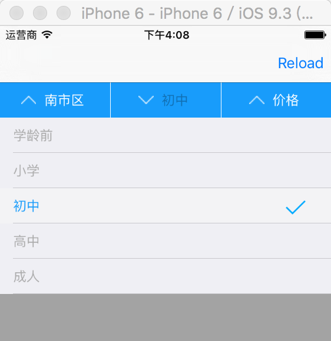

# JPullDownMenu
###这是一个简单的下拉菜单,使用详情见Demo。
---



## Usage

```
 self.menu = [[JPullDownMenu alloc]initWithFrame:CGRectMake(0, 64,self.view.frame.size.width, 40) menuTitleArray:@[@"残剑",@"长空",@"飞雪"]];
 
    NSArray * regionArray =@[@"黄浦区",@"南市区",@"卢湾区",@"徐汇区",@"不限"];
    NSArray *classTypeArray=@[@"学龄前",@"小学",@"初中",@"高中",@"成人"];
    NSArray *sortRuleArray=@[@"距离",@"价格",@"评分",@"最新",@"最热"];
    
    self.menu.menuDataArray = [NSMutableArray arrayWithObjects:regionArray, classTypeArray , sortRuleArray, nil];
    
    [self.view addSubview:self.menu];
    
    __weak typeof(self) _self = self;
    [self.menu setHandleSelectDataBlock:^(NSString *selectTitle, NSUInteger selectIndex, NSUInteger selectButtonTag) {
        
        _self.titleLabel.text = [NSString stringWithFormat:@"selectTitle = %@\n selectIndex = @%lu\n selectButtonTag = @%lu",selectTitle,selectIndex,selectButtonTag];
    }];
}
```
 

## Author

jinxiansen, email: hi@jinxiansen.com

## License

JPullDownMenu is available under the (MIT)License.